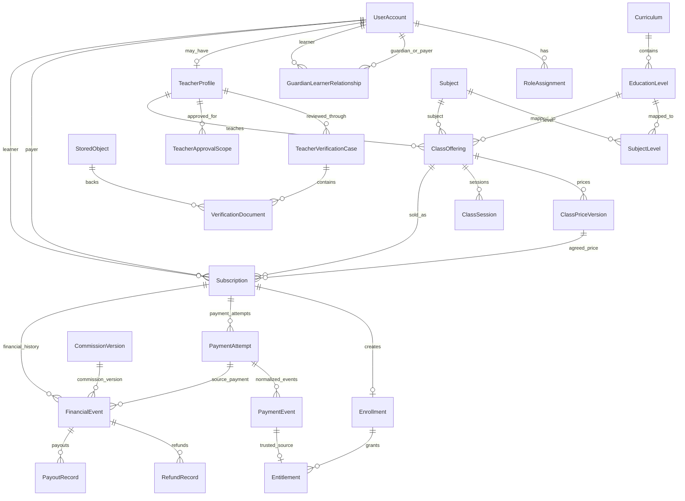

# Core data model — Issue #3 implementation

This document records the business-schema implementation that follows the reviewed Issue #3 preflight. ADR 0003 remains the technical architecture baseline.

## Entity relationship overview



## Identity and guardian/payer shape

FD-02 is implemented by allowing the same `UserAccount` to be both payer and learner. When another person pays or acts for the learner, `GuardianLearnerRelationship` stores that explicit relationship.

Authentication identity stays external to the business model: `UserAccount.clerkSubject` is unique, while roles and relationships are Taalim-owned database records.

## Prices, subscriptions, enrolments, and access

These concepts stay separate:

- `ClassPriceVersion` stores immutable price history.
- `Subscription` stores the payer, learner, class, agreed price snapshot, billing anchor, and recurring state.
- `Enrollment` is the learner/class participation record created from a subscription.
- `Entitlement` is time-bounded access and can point at the trusted payment event that created it.

The migration adds a PostgreSQL partial unique index so a learner/class cannot have two simultaneous open subscriptions in `PENDING`, `ACTIVE`, `GRACE`, or `CANCEL_SCHEDULED` states. Ended history does not block a later subscription.

## Money

MAD values are stored as integer minor units.

FD-24 is implemented as:

```text
platform commission = half-up(gross minor units × basis points / 10,000)
teacher payable     = gross minor units - platform commission
```

The database check requires a complete commission split to balance exactly:

```text
gross_minor = platform_commission_minor + teacher_payable_minor
```

`CommissionVersion` can preserve an agreed future commission rate/version without selecting a rate in Issue #3. FD-19 remains open.

Provider settlement, platform financial events, refunds, and payouts are distinct records.

## Billing anchors and time

FD-25 is represented by:

- `Subscription.originalBillingDay`
- actual `currentPeriodStartAt` and `currentPeriodEndAt`

Ordinary monthly calculation preserves the original day, clamps to the final day of a short month, and returns to the original day later. The pure calendar helper is in `src/server/billing/monthly-anchor.ts`.

The FD-09 post-failure recovery anchor is not implemented here and remains owned by Issue #11.

Application timestamps are persisted as instants. User-facing scheduling is interpreted/displayed in `Africa/Casablanca`; `ClassSession.timezone` records that scheduling context.

## Stored objects

`StoredObject` is provider-neutral. Durable identity is the internal row plus `provider + storageKey`, not a public URL or an absolute filesystem path.

Metadata includes filename, MIME type, size, optional checksum, creator, lifecycle/retention state, and timestamps. Feature-specific records reference `StoredObject`.

The storage provider remains a deployment decision behind the Issue #2 `StorageProvider` boundary.

## Payment-event idempotency

`PaymentAttempt.idempotencyKey` is unique.

`PaymentEvent(provider, providerEventId)` is unique, so duplicate callbacks cannot create two normalized events.

`Entitlement.sourcePaymentEventId` is unique, so the same trusted payment event cannot mint two entitlements.

Browser redirects are not payment evidence.

## Database-only constraints

Some PostgreSQL rules are intentionally expressed in migration SQL because Prisma cannot fully describe them:

- partial unique index for one open learner/class subscription;
- money and date-range `CHECK` constraints;
- guardian and learner in an explicit relationship must be different users;
- commission-basis-point bounds;
- non-negative stored-object sizes and money values.

These constraints are part of the schema contract and must be preserved when future migrations are authored.

## State vocabularies

The schema records stable state vocabulary for:

- class lifecycle;
- verification cases and approval scopes;
- subscriptions;
- enrollments;
- entitlements;
- payment attempts;
- refunds;
- payouts;
- stored-object lifecycle;
- class sessions.

Allowed business transitions remain application/domain-service rules. A row being technically updatable to an enum value does not itself authorize that transition.

The reviewed preflight remains the reference for state-machine intent and unresolved later-feature behavior.

## Synthetic data

`pnpm db:seed` creates only deterministic synthetic curriculum, user, teacher, class, and price records. It contains no production identity data or credentials.

## Verification contract

The Issue #3 implementation must prove:

- clean migration from an empty PostgreSQL database;
- Prisma generation/validation;
- synthetic seed success;
- self-pay account support and explicit separate payer/learner relationships;
- one concurrent winner for an open learner/class subscription;
- provider payment-event deduplication;
- one entitlement per trusted source payment event;
- stored-object provider/key uniqueness;
- financial split check enforcement;
- existing production/staging test-database refusal remains intact.
