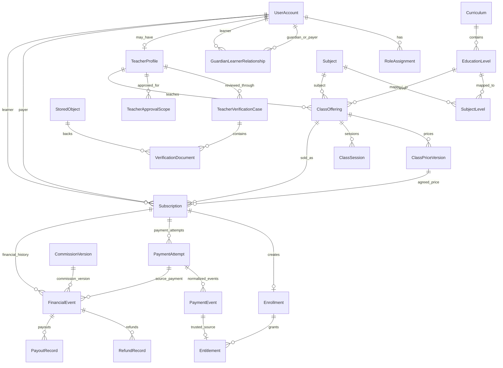

# Core data model — Issue #3 implementation

This document records the business-schema implementation that follows the reviewed Issue #3 preflight. ADR 0003 remains the technical architecture baseline.

## Entity relationship overview



## Identity and guardian/payer shape

FD-02 is implemented by allowing the same `UserAccount` to be both payer and learner. When another person pays or acts for the learner, `GuardianLearnerRelationship` stores that explicit relationship.

Authentication identity stays external to the business model: `UserAccount.clerkSubject` is unique, while roles and relationships are Taalim-owned database records.

## Prices, subscriptions, enrolments, and access

These concepts stay separate:

- `ClassPriceVersion` stores immutable price history. PostgreSQL enforces that a referenced version cannot have its class, amount, currency, or effective dates changed.
- `Subscription` stores the payer, learner, class, agreed price snapshot, billing anchor, and recurring state.
- `Enrollment` is the learner/class participation record created from a subscription.
- `Entitlement` is time-bounded access and can point at the trusted payment event that created it.

The migration adds a PostgreSQL partial unique index so a learner/class cannot have two simultaneous open subscriptions in `PENDING`, `ACTIVE`, `GRACE`, or `CANCEL_SCHEDULED` states. Ended history does not block a later subscription.

Cross-entity consistency is also enforced in PostgreSQL:

- a class can only point at a current price version owned by that same class;
- a subscription can only reference a price version owned by its subscribed class;
- an enrollment's subscription, learner, and class must match the linked subscription exactly.

## Money

MAD values are stored as integer minor units.

FD-24 is implemented as:

```text
platform commission = half-up(gross minor units × basis points / 10,000)
teacher payable     = gross minor units - platform commission
```

The database check requires a complete commission split to balance exactly:

```text
gross_minor = platform_commission_minor + teacher_payable_minor
```

`CommissionVersion` can preserve an agreed future commission rate/version without selecting a rate in Issue #3. FD-19 remains open.

Provider settlement, platform financial events, refunds, and payouts are distinct records.

## Billing anchors and time

FD-25 is represented by:

- `Subscription.originalBillingDay`
- actual `currentPeriodStartAt` and `currentPeriodEndAt`

Ordinary monthly calculation preserves the original day, clamps to the final day of a short month, and returns to the original day later. The pure calendar helper is in `src/server/billing/monthly-anchor.ts`.

The FD-09 post-failure recovery anchor is not implemented here and remains owned by Issue #11.

Application timestamps are persisted as instants. User-facing scheduling is interpreted/displayed in `Africa/Casablanca`; `ClassSession.timezone` records that scheduling context. Future schedule-to-UTC conversion must use the IANA zone rules for `Africa/Casablanca`, never a hard-coded UTC offset, so offset changes do not move the intended local class time.

## Stored objects

`StoredObject` is provider-neutral. Durable identity is the internal row plus `provider + storageKey`, not a public URL or an absolute filesystem path.

Metadata includes filename, MIME type, size, optional checksum, creator, lifecycle/retention state, replacement lineage, and timestamps. Feature-specific records reference `StoredObject`.

Replacement/versioning uses a one-to-one `replacesObjectId` chain. A new object is inserted first, then the previous object may be marked `SUPERSEDED`; its metadata is not rewritten to point at the new provider key.

Lifecycle and cleanup rules:

- `ACTIVE`: metadata and provider object are expected to exist.
- `QUARANTINED`: bytes exist but are not available to ordinary feature access.
- `MISSING`: metadata exists but a durability/reconciliation check could not find the provider object. The metadata row is retained for diagnosis rather than silently deleted.
- `SUPERSEDED`: a replacement object exists; historical references remain auditable.
- `DELETED`: logical deletion has been approved. `deletedAt` records the logical deletion time; physical deletion is executed through the storage boundary.
- `retentionUntil` is nullable because category-specific retention periods remain later product/legal decisions.
- Feature references use restrictive foreign keys where historical evidence must not disappear. Orphan cleanup is therefore explicit: first reconcile references and lifecycle state, then delete provider bytes, and only remove metadata when no retained business/audit record requires it.

The storage provider remains a deployment decision behind the Issue #2 `StorageProvider` boundary.

## Transaction boundaries

The schema defines the records and database guards; later feature services own the business transactions. These boundaries are required when those services are implemented:

- checkout/activation: normalize the trusted payment event, create the financial event, move the subscription state, create enrollment when required, and mint the entitlement in one database transaction or an equivalent idempotent transaction sequence;
- renewal: period advancement and the new entitlement must be coupled to the unique trusted payment event so retries cannot extend access twice;
- cancellation wins over stale retry work through state/version checks in the #11 job/service layer;
- refunds and payouts append their own records and must not rewrite the original collection event;
- stored-object metadata creation/replacement is separate from provider byte I/O, with reconciliation state used when one side succeeds and the other does not.

Database uniqueness/check constraints are the final concurrency backstop; they do not replace application transaction design.

## Payment-event idempotency

`PaymentAttempt.idempotencyKey` is unique.

`PaymentEvent(provider, providerEventId)` is unique, so duplicate callbacks cannot create two normalized events.

`Entitlement.sourcePaymentEventId` is unique, so the same trusted payment event cannot mint two entitlements.

Browser redirects are not payment evidence.

## Database-only constraints

Some PostgreSQL rules are intentionally expressed in migration SQL because Prisma cannot fully describe them:

- partial unique index for one open learner/class subscription;
- composite foreign keys tying price versions to their owning class and enrollments to the exact subscription learner/class;
- money and date-range `CHECK` constraints;
- guardian and learner in an explicit relationship must be different users;
- commission-basis-point bounds;
- non-negative stored-object sizes and money values.

These constraints are part of the schema contract and must be preserved when future migrations are authored.

## State-machine contract

The database stores state vocabulary; application services own allowed transitions and must apply them transactionally.

| Machine | Allowed foundation transitions | Deferred/guarded behavior |
| --- | --- | --- |
| Class | `DRAFT -> PUBLISHED -> CLOSED_TO_RENEWAL -> ENDED` | direct end/reactivation must honor later class obligations and FD-04/FD-05 |
| Payment attempt | `CREATED -> PENDING -> SUCCEEDED`; `PENDING -> FAILED/CANCELLED`; retry may return `FAILED -> PENDING` idempotently | provider-specific retry policy belongs to #9/#11 |
| Subscription | `PENDING -> ACTIVE`; `ACTIVE -> GRACE`; `ACTIVE -> CANCEL_SCHEDULED -> ENDED`; `GRACE -> ACTIVE/ENDED` | the post-recovery billing anchor remains deferred to #11 |
| Entitlement | `PENDING -> ACTIVE -> EXPIRED`; `ACTIVE -> REVOKED` only through an authorized admin/security path | entitlement creation must follow trusted payment evidence |
| Refund | `REQUESTED -> APPROVED -> PROCESSING -> SUCCEEDED`; rejection from `REQUESTED`; failure from `PROCESSING` | refund entitlement/formula remains FD-20 |
| Payout | `PENDING -> HELD/APPROVED`; `HELD -> APPROVED`; `APPROVED -> PROCESSING -> PAID`; `PROCESSING -> FAILED` | real provider settlement waits on #4/#13 and legal/provider gates |

A row being technically updatable to an enum value does not authorize that transition.

## State vocabularies

The schema records stable state vocabulary for:

- class lifecycle;
- verification cases and approval scopes;
- subscriptions;
- enrollments;
- entitlements;
- payment attempts;
- refunds;
- payouts;
- stored-object lifecycle;
- class sessions.

Allowed business transitions remain application/domain-service rules. A row being technically updatable to an enum value does not itself authorize that transition.

The reviewed preflight remains the reference for state-machine intent and unresolved later-feature behavior.

## Synthetic data

`pnpm db:seed` creates only deterministic synthetic curriculum, user, teacher, class, and price records. It contains no production identity data or credentials.

## Verification contract

The Issue #3 implementation must prove:

- clean migration from an empty PostgreSQL database;
- Prisma generation/validation;
- synthetic seed success;
- self-pay account support and explicit separate payer/learner relationships;
- one concurrent winner for an open learner/class subscription;
- provider payment-event deduplication;
- one entitlement per trusted source payment event;
- stored-object provider/key uniqueness;
- stored-object replacement lineage and lifecycle representation;
- financial split check enforcement;
- existing production/staging test-database refusal remains intact.
